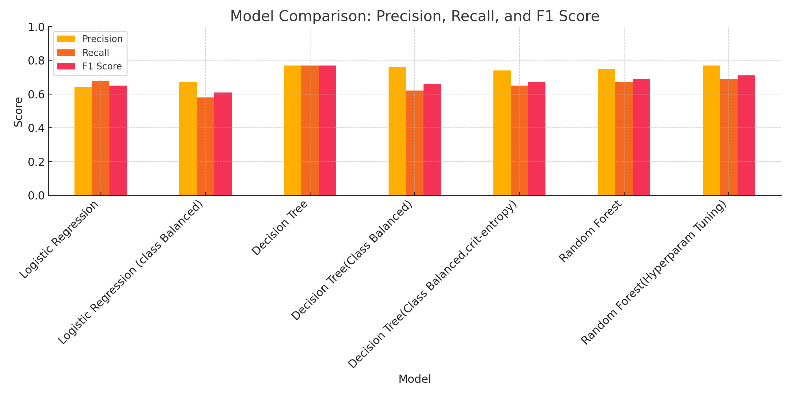
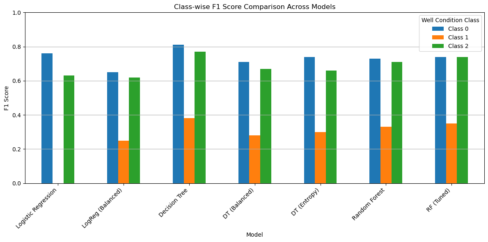

# 💧 Predicting the Functional Status of Tanzanian Water Wells

## 📌 Overview

Access to clean and functioning water wells is crucial in Tanzania, where many rural communities depend on them for daily life. This project aims to use machine learning to predict the **functional status** of water wells—whether they are **functional**, **non-functional**, or **need repair**—based on characteristics such as location, installation details, and water quality.

This classification task provides practical value to organizations that manage and maintain wells by helping prioritize maintenance and funding for at-risk water points.

---

## 🧠 Business and Data Understanding

### 👥 Stakeholder Audience

Our primary stakeholders include:

- **Non-Governmental Organizations (NGOs)** working on water access and rural development
- **Government agencies** responsible for infrastructure and water resource management
- **Local authorities** tasked with well monitoring and community welfare

These groups benefit from knowing **which wells are likely to fail** or are already non-functional, enabling **efficient resource allocation**, **proactive repair planning**, and **community health interventions**.

### 🧾 Dataset Description

The dataset is sourced from **Tanzania’s Water Point Mapping** initiative, provided by [Taarifa and WaterAid](https://www.drivendata.org/competitions/7/pump-it-up-data-mining-the-water-table/). It contains over 59,000 records of water points with attributes such as:

- `location`: region, district, ward
- `technical details`: installer, construction year, pump type
- `management`: funder, scheme management, water quality
- `status_group` (target): **Functional**, **Needs Repair**, **Non-Functional**

This diverse, real-world dataset is ideal for applying supervised machine learning to predict the status of water wells and gain actionable insights.

---

## 🧪 Modeling Approach

We framed the problem as a **multi-class classification** task and experimented with various models, including:

- **Logistic Regression**
- **Decision Tree Classifier**
- **Random Forest Classifier** (default and with hyperparameter tuning)

Key preprocessing steps included:

- Dropping redundant or highly incomplete columns
- Handling class imbalance with `class_weight='balanced'` in some models
- Encoding categorical features using one-hot or label encoding
- Scaling numerical features where appropriate

We split the data into training and test sets using a standard 80/20 approach and applied cross-validation where necessary.

---

## 📊 Evaluation

Each model was evaluated on the test set using the following metrics:

- **Accuracy**: Overall correctness
- **Precision**: How many predicted statuses were actually correct
- **Recall**: How many actual statuses were correctly identified
- **F1 Score**: Balance between precision and recall (especially important for imbalanced classes)

  

### 🔍 Summary of Key Results

| Model                              | Accuracy | Precision | Recall | F1 Score |
|-----------------------------------|----------|-----------|--------|----------|
| Logistic Regression               | 0.68     | 0.64      | 0.68   | 0.65     |
| Logistic Regression (Balanced)    | 0.58     | 0.67      | 0.58   | 0.61     |
| Decision Tree                     | 0.77     | 0.77      | 0.77   | 0.77     |
| Decision Tree (Balanced)          | 0.62     | 0.76      | 0.62   | 0.66     |
| Decision Tree (Entropy Criterion) | 0.65     | 0.74      | 0.65   | 0.67     |
| Random Forest                     | 0.67     | 0.75      | 0.67   | 0.69     |
| Random Forest (Tuned)             | **0.69** | **0.77**  | **0.69**| **0.71** |

> The **tuned Random Forest Classifier** offered the best overall balance, although the basic **Decision Tree** had the highest raw accuracy—potentially due to overfitting.

Special attention was paid to the **“Needs Repair”** class, which had the weakest performance due to its minority representation. Addressing this issue is a key focus for improvement.

  

---

## ✅ Conclusion

This project successfully demonstrates how machine learning can support **resource planning and maintenance decisions** for rural water infrastructure in Tanzania.

**Key Takeaways:**

- **Random Forest** was the most balanced and robust model
- **Class imbalance** significantly affected the prediction of minority classes
- **Feature importance analysis** (e.g., installer, pump type, region) provided actionable insights for stakeholders

**Next Steps:**

- Improve data quality and representation of the “Needs Repair” class
- Deploy the model in an interactive tool for decision-makers
- Use geospatial visualizations to map predicted statuses
- Retrain periodically as new well data is collected

This solution provides a **data-driven framework** for tackling water access issues and supporting Tanzania’s path to sustainable water management.

---

📁 **Note**: For the full analysis, including code, please see the accompanying Jupyter Notebook in this repository.

